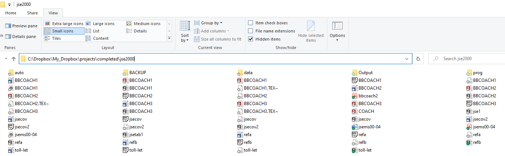

ECON 709: Reproducible Research Projects
========================================================
author: Brad R. Humphreys
date: Spring 2022
autosize: true

What is Reproducible Research?
========================================================

* “Reproducibility is just collaboration with people you don’t know, including yourself next week” quote from Philip Stark, University of California Berkeley Statistics Department
* Designing a research project so that an independent outside observer can reproduce all results in your final paper without any instructions from you, using your code and data
* Building blocks of reproducible research: 

1. file, folder, and variable naming 
2. folder structure 
3. metadata 
4. raw data integrity 
5. scripting

Why Undertake Reproducible Research?
========================================================

- Journals are increasingly requiring submission of code and data along with papers, also employing data editors to check replication
- Facilitates collaborative research
- Helps your future self. This approach will save you hundreds, perhaps thousands of hours spent "reinventing the wheel" over your career
- Trust me on this.  I learned the hard way.
- Also useful in disseminating your research.  Example: this presentation is available on my Github repository

https://github.com/brhumphreys/reproducible_research_presentation

Naming Conventions
========================================================

* All names should provide information about the contents
* Names should be "human readable"
* Never, never, never include spaces in any folder or file name
* No "garbage" characters!  @#$~&*+= and the like
* Use "-" and "_" for readability
* Take advantage of standard OS ordering: 0-9, a-z (and left pad initial numbers) 
* Bad: datafile 1.csv
* Good: raw_price_data_from_bls.csv 

Folder Structure
========================================================

* Folder names convey information about folder contents
* Needs to be adaptable to your project
* I often use something along these lines

📁 project_name  
|── README.md  
|── requirements.txt  
|── code/  
|── data/  
|── literature/  
|── documents/  
|── workflow/  

Metadata
========================================================

* Data on data.  The who, what, when, where, why, how of your research.
* Every folder should have a file with metadata for that folder
* Every file that analyzes data should have metadata at the top in comments
* Many formats out there, I prefer README.md files using basic markdown 
* More information: 
* README.md metadata https://data.research.cornell.edu/content/readme
* General https://data.research.cornell.edu/content/writing-metadata

========================================================  
📁 project  
|── README.md  
|── requirements.txt  
|── raw_data/  
|   ├── bls_raw_price_data.csv  
|   └── README.md    
|── code/  
|   ├── 01_utilities.R  
|   ├── 02_data_cleaning.R  
|   ├── 03_analysis.R  
|   └── 04_generate_plots_and_tables.R  
|   └── README.md  
|── results/  
|   ├── cleaned_data.csv  
|   └── derived_data.csv  
|   └── README.md  
***

|── outputs/  
|   └── latex/  
|       ├── README.md  
|       ├── paper.tex  
|       └── slides.tex  
|    ── floats/  
|       ├── README.md  
|       ├── table.tex  
|       └── time_series_plot.pdf  

Raw Data Integrity
========================================================

* Key component of reproducible research
* You will collect data from somewhere (scraping, downloading. etc.)
* Put this in the raw_data/ folder and treat it as read only!
* Never, never, never make changes to these files "by hand" in a text editor or spreadsheet
* Why?  Because those changes are not documented, so the independent observer cannot reproduce then
* All data manipulation should be scripted

Script Everything
========================================================

* Never, never, never enter command line code
* Even if you are just "exploring" a data set, use a script
* Script names should reflect contents
* Include metadata in comments at the top iof every script.  When it was writtemn, what id does what input files it needs, what it produces
* Use comments in your scripts.  This is for the future you.  Trust me, they are important
* Ideally have one "master" script that runs all scripts needed to read, clean, mainpulate and analyze data

========================================================
**Folder 1**  
01_read-raw-price-data.R  
02_merge-in-state-data.R  
03_deflate-to-2020-dollars.R  
04_make-time-series-graph.R  
05_summary-stat-table.R  
06_results-table-ols.R  
07_results-table-iv.R  
08_make-scatter-plot.R  
09_robustness-check-cluster.R  
10_run-all-files.R  
***

**Folder 2**  
deflateit.R  
first&secondstaiv.R  
makegraphsts.R  
othresult21.R  
read 11.R  
runolsmodel.R  
scttrpl1.R  
st dt mg.R  
sumst1125.R  

Example: Humphreys, J Sports Econ 2000
========================================================

* Old paper of mine, but I still have my project folder

* Lets see how this project folder organization holds up

========================================================

* The folder structure is OK, but what's "auto" and "backup"?
* No idea, but I have to open the folder to see.  That's bad
* First question: where's the paper?
* Ugh, it's in the main jse2000/ project folder

========================================================

* That's a mess.  No idea where the final document is
* And what's all that other stuff?
* No metadata, of course.  That would be helpful
* Needs a documents/ folder and subfolder structure

========================================================

***

* More poor naming, and a mish-mash of file formats
* SAS data files.  Doubt I could open them now.  
* This highlights the importance of saving raw data files in a portable format like text

========================================================

***

* Lets take a look at the code
* SAS scripts, of course.  At least they are text files!
* Poor naming convention, can't tell what is going on
* No STATA .do files.  I wonder how the STATA data files in data/ were created?

========================================================

***

* Here's a script
* Sketchy metadata at top, no comments :-(

Final Assessment of my Former Self
========================================================

* Did 2000 Brad leave 2022 Brad enough information to understand the project?  LOL Noope!
* Folder structure C+
* File naming C-
* Folder metadata F
* Code metadata C+
* Reproducible?  Not a chance

